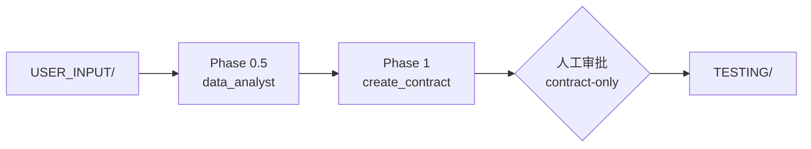
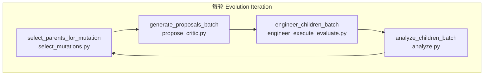

# AgenticSciML 代码结构分析

> 基于预印本论文 [AgenticSciML, npj AI 2026](https://doi.org/10.1038/s44387-026-00102-5) 与仓库 `AgenticSciML/` 源码的对照分析。  
> 分析日期：2026-06-25

---

## 1. 总体定位：论文概念 ↔ 代码实现

论文将 AgenticSciML 定义为：**10+ 专用 LLM Agent 通过结构化辩论、RAG 方法记忆、集成引导的进化树搜索**，自动发现 SciML 建模策略（架构、损失、训练流程），而非仅调超参。

代码实现为 **单仓库、单入口、三阶段流水线**，核心在 `src/`：

```
AgenticSciML/
├── framework.jpg              # 论文 Figure 4 对应框架图
├── README.md / LICENSE
└── src/
    ├── main.py                # 总编排器
    ├── agents.py              # 全部 Agent 实现 + 执行工具
    ├── constants.py           # 路径、超参、模型路由
    ├── create_contract.py     # Phase 1
    ├── create_root.py         # Phase 2
    ├── propose_critic.py      # 变异规划（辩论）
    ├── select_mutations.py    # 父节点选择（集成投票）
    ├── engineer_execute_evaluate.py  # 变异工程+训练+评测
    ├── retrieve_KB.py / retrieve_AB.py / retrieve_champion.py
    ├── analyze.py / data_analyst.py / run_data_analysis.py
    ├── telemetry.py
    ├── KB/                    # 70 条 SciML 方法记忆
    └── USER_INPUT/            # 问题规格（用户填写）
```

运行时还会生成（首次执行后）：

| 目录 | 论文概念 | 内容 |
|------|----------|------|
| `TESTING/` | Evaluation Contract | `evaluate.py`, `guidelines.md` |
| `DATA_ANALYSIS/` | EDA 报告 | `data_analysis.md` |
| `SOLUTION_AND_OUTPUTS/` | 解树节点 | 每个 `solution_*` 含 `solution.py`、日志、checkpoint |
| `AB/` | Analysis Base | `analysis_*.md` 性能分析报告 |
| `PROPOSAL_POOL/` | 辩论记录 | `proposal_*.md`, `discussion_*.md` |
| `RESULTS/` | 解树元数据 | `results.json`, `telemetry_summary.json` |
| `SELECTION_LOGS/` | 集成选择日志 | 各 selector 投票记录 |

---

## 2. 三阶段流水线（论文 Figure 4 / Algorithm 1）

### 2.1 论文 Phase 1：初始化（用户输入 → EDA → 评测契约）



| 步骤 | 论文 Methods | 代码模块 | 关键 Agent |
|------|-------------|----------|-----------|
| 结构化输入 | `problem.md`, `requirements.md`, `evaluation.md`, `dataset_config.json` | `USER_INPUT/` | — |
| 探索性数据分析 | 多模态 Data Analyst，仅分析训练集 | `run_data_analysis.py` → `data_analyst.py` | `data_analyst` (Gemini) |
| 评测契约 | 生成 `evaluate.py` + `guidelines.md`，人工审批 | `create_contract.py` (LangGraph) | `tester` (Claude) |

**契约设计要点**（`create_contract.py` + `agents.tester_agent`）：

- `evaluate.py` 必须输出带 `--- FINAL SCALAR METRIC ---` 标记的 JSON（`status`, `score`），供全树统一排名。
- Tester **只看 validation set**；training set 信息写入 `guidelines.md` 供 Engineer 使用，避免评测泄漏。
- `--mode contract-only` 需人工审批；`--mode full` 自动 `auto_approve=True`。

### 2.2 论文 Phase 2：Root Solution（单 Agent 基线）

| 步骤 | 论文描述 | 代码 | 设计意图 |
|------|----------|------|----------|
| 生成 `solution_0` | 单 Root Engineer，**无 KB、无辩论** | `create_root.py` | 隔离多 Agent 增益 |
| validate → train → evaluate | 先 1 epoch 冒烟，再全量训练 | `agents.execute_solution` | 控制成本 |
| 失败归因 | Validator 区分 tester/engineer 错误 | `validator_agent` | 契约 vs 代码责任 |
| 结果分析 | Result Analyst 写 `analysis_0.md` | `analyze.py` → `analyst_agent` | 写入 Analysis Base |

Root 解目录：`SOLUTION_AND_OUTPUTS/solution_0/`，并在 `RESULTS/results.json` 注册 `{score, parent_id, status, ...}`。

### 2.3 论文 Phase 3：进化树扩展（核心创新）

每轮迭代在 `main.run_evolutionary_loop` 中串行执行四步，**子任务内部并行**：



#### 3.1 父节点选择（Ensemble-Guided Parent Selection）

论文：成熟阶段 = **最优解（exploitation）** + **K−1 个集成投票父节点（exploration）**。

代码（`main.select_parents_for_mutation` + `select_mutations.py`）：

- `MUTATION_BATCH=4`：每轮 4 个并行变异。
- **早期**（成功解 ≤ 4）：全部成功解都变异。
- **成熟阶段**：最优解必入选；其余从 top-(K+1) 池中由 **GPT + Grok + Gemini** 三模型各提名，多数票决定（对应论文 Figure 2/5）。
- `MAX_CHILDREN_PER_NODE=10`：单节点子代达上限则不再被选为父节点。

#### 3.2 解树编码规则（重要实现细节）

子代 ID 通过在父 ID 数字后缀**追加一位**生成：

```
solution_0
├── solution_00, solution_01, ...     ← 第 1 层子代
│   └── solution_010, solution_011    ← 第 2 层
```

`retrieve_AB.py` 用「去掉末位数字」推断 parent/sibling/uncle，与论文 Methods 中 parent / sibling / uncle 分析报告检索一致。

#### 3.3 规划：RAG + 多 Agent 辩论

`propose_critic.generate_proposal` 在变异前组装上下文：

| 来源 | 模块 | 论文对应 |
|------|------|----------|
| KB 0–1 条 | `retrieve_KB.py` → `retriever_agent` | Retrieval-augmented method memory |
| 父/兄弟/叔分析报告 | `retrieve_AB.py`（确定性脚本） | Analysis Base context |
| 父代码 + 父分析 | 从 `SOLUTION_AND_OUTPUTS`, `AB/` 读取 | Parent weakness |
| Proposer ↔ Critic N 轮 | `propose_critic.py` (LangGraph) | Structured debate |

辩论流程（LangGraph：`propose → critique → propose → ... → finalize`）在 `propose_critic.py` 中实现，通过 `should_critique` / `should_continue` 控制轮次。

**论文 vs 代码差异**：论文实验用 **N=4** 轮（2 轮纯推理、1 轮综合、1 轮定稿）；代码默认 `MAX_PROPOSE_CRITIC_ROUNDS=3`（2 轮推理+批评，第 3 轮直接定稿无批评）。可通过 `constants.py` 或环境变量调整。

输出：`PROPOSAL_POOL/proposal_{child_id}.md` + 完整辩论日志。

#### 3.4 工程：实现 + 调试 + 训练 + 评测

`engineer_execute_evaluate.py`（子进程，可绑定 GPU）：

1. Engineer 基于父代码 + proposal 修改 → `solution.py`
2. Debugger 循环（最多 5 次）修复 validate/train 错误
3. 全量训练 + `evaluate.py` 打分
4. 写入 `results.json`（**无人工审批**，与 root 不同）

多 GPU：`main.py --gpu_ids 0 1 2 3`，`ProcessPoolExecutor` + `CUDA_VISIBLE_DEVICES` 轮询分配。

#### 3.5 评测后分析

`analyze.py` 调用多模态 `analyst_agent`：读训练/测试日志 + 图像（loss 曲线等），生成 `AB/analysis_{id}.md`，供下一轮检索。

最终冠军：`retrieve_champion.get_champion()` 取 `results.json` 中 score 最低且未达子代上限的解。

---

## 3. Agent 层：`agents.py` 中枢

论文 10+ Agent 在代码中映射如下：

| 论文角色 | 代码 Agent | 默认模型 | 职责 |
|----------|-----------|----------|------|
| Evaluator / Tester | `tester_agent` | Claude Haiku | 生成评测契约 |
| Data Analyst | `data_analyst` (via `data_analyst.py`) | Gemini Flash | EDA + 视觉分析 |
| Root Engineer | `engineer_agent` (root 流程) | Claude Haiku | 生成 `solution_0` |
| Engineer | `engineer_agent` | Claude Haiku | 按 proposal 改代码 |
| Debugger | `debugger_agent` | GPT-5-mini | 修复运行错误 |
| Validator | `validator_agent` | — | root 阶段契约/代码归因 |
| Retriever | `retriever_agent` | Gemini Flash | 从 70 条 KB 选 0–1 条 |
| Proposer | `proposer_agent` | Gemini Flash/Pro | 推理 + 方案 |
| Critic | `critic_agent` | GPT-5-mini | 挑战与可行性评估 |
| Result Analyst | `analyst_agent` | Gemini | 多模态结果报告 |
| Selector Ensemble | `select_mutations.py` 内独立 LLM | GPT + Grok + Gemini | 父节点投票 |

模型路由与环境变量均在 `constants.py` 的 `AGENT_MODELS` 与 `TEMPERATURES` 中配置。

基础设施：

- **LangChain** + **Pydantic structured output** 约束各 Agent 输出格式
- **LangGraph** 编排 contract / root / proposal 工作流
- **`telemetry.py`** 记录 token、成本、延迟（对应论文 Token and Cost Analysis）

执行原语（非 LLM）：

- `execute_solution(solution_dir, mode="validate"|"train")`
- `execute_evaluation(solution_dir)` → 解析 scalar score

---

## 4. 知识库 KB：论文 Table 4 ↔ `src/KB/`

论文：**70 条** SciML 方法条目，半自动从论文+GitHub 代码提炼，结构化 Markdown + `indices.json` 索引。

代码现状：**70 个 `.md` + 70 条 `indices.json` 记录**，与论文一致。

每条 entry 结构（论文 Figure 6）：

- Problem Setup / Issues addressed / Core method / Implementation snippets / Critical parameters

方法族覆盖（与论文 benchmark 直接相关）：

- **PINN 系**：gPINN, Self-Adaptive PINN, MoE-PINN, hp-VPINN, hPINN, NSFnet…
- **Operator 系**：DeepONet, PI-DeepONet, FNO, U-FNO, CNO, Oformer, GNOT, ICON…

检索逻辑（`retrieve_KB.py`）：

1. 加载 `indices.json` 全部摘要
2. `retriever_agent` 读父解代码 + `analysis_*.md`，选 **0 或 1** 条最相关 entry
3. 支持 ablation 模式：`SCIML_KB_RANDOM_SEED` → Random KB；禁用 retriever → No KB（论文 Table 2/3）

---

## 5. 用户输入层：`USER_INPUT/`（对接新问题的入口）

论文 Structured User Input 四文件：

| 文件 | 作用 |
|------|------|
| `problem.md` | 物理/数学问题描述 |
| `requirements.md` | 框架、库、硬件约束 |
| `evaluation.md` | 成功指标定义 |
| `dataset_config.json` | 可选 train/validation 数据路径与加载说明 |

仓库自带示例为**简单函数逼近回归**（`problem.md` 仅一行描述），对应论文 Supplementary S1.1 类问题；**6 个 benchmark 的完整 USER_INPUT 需自行配置**（论文称数据在 GitHub，但当前仓库只含通用示例）。

---

## 6. 入口与运行模式

```bash
cd src
python main.py --mode contract-only   # Phase 0.5 + 1，人工审契约
python main.py --mode root-only       # Phase 2
python main.py --mode evolve-only     # Phase 3（需已有 root + results.json）
python main.py --mode full            # 全自动（契约自动批准）
```

关键超参（`constants.py`，可用环境变量覆盖）：

| 参数 | 默认 | 论文 |
|------|------|------|
| `MAX_EVOLUTIONARY_ITERATIONS` | 8 | 各 benchmark 3–6 轮 |
| `MUTATION_BATCH` | 4 | 并行变异 batch |
| `SELECTION_POOL_SIZE` | 8 | selector 候选池 |
| `MAX_PROPOSE_CRITIC_ROUNDS` | 3 | 论文 N=4 |
| `TIMEOUT_TRAINING` | 7200s | GPU 训练瓶颈（论文 Poisson 5.6h GPU vs 1.7h LLM） |

集群脚本：`main_run.sh`（SLURM 示例）。

---

## 7. 论文 Results 与代码能力的对应关系

| 论文发现 | 代码机制支撑 |
|----------|-------------|
| 多 Agent 比单 Agent 优 10×–11000× | root（无 KB/辩论）vs evolve（完整流水线） |
| 涌现策略（MoE gating、分解 PINN、分阶段训练等） | proposer+critic+KB+AB 组合推理，engineer 落地 |
| 集成投票第 3 选择分歧大 → 探索性 | `select_mutations.py` 三模型各提名 3 个 |
| KB ablation（Full > No > Random） | `retrieve_KB.py` 可禁用/随机化 |
| 成本 \$2–\$11/实验 | `telemetry.py` 按 agent 统计 |
| 6 类 benchmark（PINN + Operator + 逆问题） | KB 覆盖对应方法；USER_INPUT 需按问题定制 |

---

## 8. 架构特点与局限（结合论文 Discussion）

### 设计优点

1. **契约先行**：`evaluate.py` 统一接口，使异构 SciML 方案可比较（论文强调 consistent evaluation）。
2. **Analysis Base 持久记忆**：分析报告可检索，形成「实验-反思-改进」闭环。
3. **职责分离**：Proposer 推理 / Engineer 编码 / Debugger 修错，降低单 Agent 负担。
4. **并行化**：proposal 用线程池；engineering 用进程池 + 多 GPU。

### 当前局限

1. KB 质量与检索相关性直接影响轨迹（Random KB 可误导）。
2. 辩论质量依赖 LLM，无严格物理验证器（除数值训练/评测）。
3. 进化开销 ∝ 训练成本；GPU 时间常 dominates LLM 时间。
4. 代码针对 circa-2025 模型/API，README 已警告 prompt drift。
5. 解 ID 字符串编码树结构，深度过大时 ID 变长，逻辑依赖 `results.json` 的 `parent_id` 字段。

---

## 9. 面向 plasma etching 适配的关键路径

若将本框架用于 `agentic-sciml-for-plasma-etching`，代码结构上需动的是 **输入层与 KB 扩展**，而非核心流水线：

1. **`USER_INPUT/`**：刻蚀过程 PDE/ODE、传感器数据、MSE 或物理残差指标。
2. **`KB/`**（可选）：增加 plasma/etch 相关 SciML 条目或精简为问题相关子集（论文建议 Full KB 测试 retriever 鲁棒性，但应用时可裁剪）。
3. **`--mode contract-only`**：先审 `TESTING/evaluate.py`，确保 score 与工艺 KPI 一致。
4. **`--mode root-only` → `evolve-only`**：在 GPU 集群上跑进化阶段。

核心模块 **`main.py` → propose/critic → engineer → analyze** 无需修改即可复用。

---

## 10. 模块依赖总览

```
main.py
├── Phase 0.5: run_data_analysis → data_analyst → agents
├── Phase 1:   create_contract → agents.tester (LangGraph)
├── Phase 2:   create_root → agents.engineer/validator/execute_* → analyze
└── Phase 3:   select_mutations (ensemble LLMs)
               propose_critic → retrieve_KB + retrieve_AB → agents.proposer/critic
               engineer_execute_evaluate → agents.engineer/debugger/execute_*
               analyze → agents.analyst
               telemetry.merge_telemetry
```

---

## 结论

AgenticSciML 代码是论文 Algorithm 1 的**直接工程化实现**——以 `main.py` 为编排核心，`agents.py` 为 Agent 层，`retrieve_*` 实现双重记忆（KB + AB），`propose_critic` + `select_mutations` 实现「辩论 + 集成进化搜索」，运行时目录构成可持久化的解树与实验记录。对 plasma etching 场景，主要工作在于 **`USER_INPUT` 问题规格化** 与 **评测契约设计**，框架本身已具备完整的 SciML 策略发现流水线。
