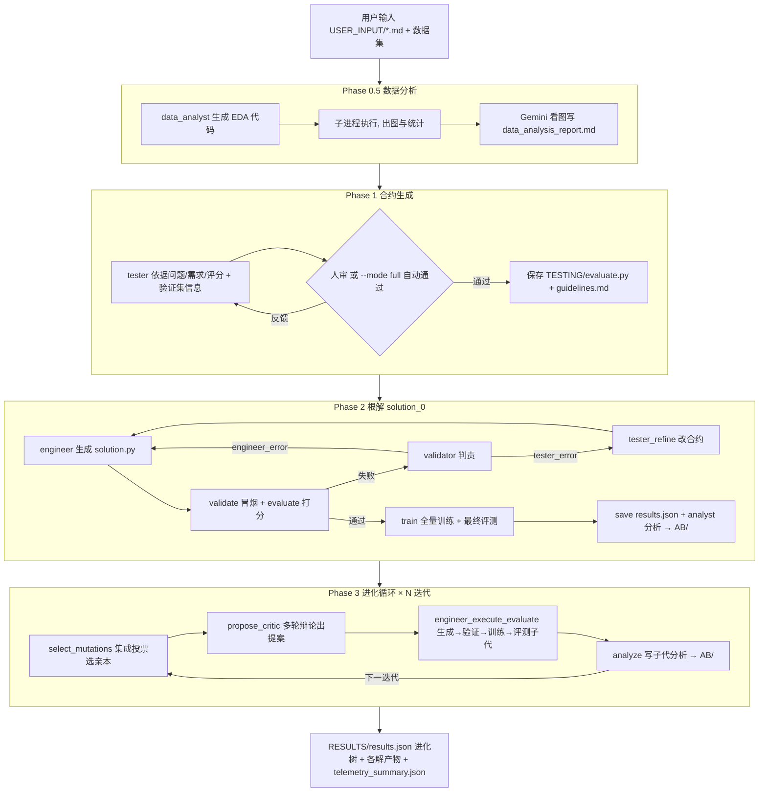

# AgenticSciML 工程分析报告

> 本报告基于对 `src/` 全部源码的通读整理，配合已加入各源文件的中文学习注释一起阅读效果更佳。
> 关注点：**整体架构、工作流（workflow）、以及每个阶段/模块的输入输出（I/O）**。

---

## 1. 项目概述

**AgenticSciML** 是一个**纯命令行的多智能体（multi-agent）大模型系统**，用于**自动地"提出 → 批判 → 进化"科学机器学习（SciML，基于 PyTorch）的解决方案**。

它的核心思想：把"科研中做实验、写代码、跑训练、看结果、改进方法"的过程，交给一组分工明确的 LLM 智能体协作完成，并用**进化树搜索（evolutionary tree search）+ 多智能体辩论（multi-agent debate）+ 检索增强记忆（RAG）** 来不断迭代出更优的模型代码。

- **输入**：用户用几个 markdown 文件描述"要解决什么问题、有什么要求、如何评分"，外加数据集。
- **输出**：一批由 AI 自动生成、可运行、经过训练与评测打分的 PyTorch 解决方案（`solution.py`），以及每个解的分析报告、进化关系、成本遥测。
- **目标**：以 MSE 等指标为准，逐代降低误差（论文宣称最高可比单智能体基线降低 4 个数量级）。

> 注意：本仓库**没有 Web 界面、没有自动化测试、没有 lint/build 工具**；"运行程序"即运行 `src/main.py` 这条 CLI 管线。运行任何阶段都会**立即调用 LLM**，因此必须先配置模型 API Key（见 `README.md` 与 `AGENTS.md`）。

---

## 2. 技术栈与依赖

| 类别 | 组件 |
|---|---|
| 编排框架 | **LangGraph**（`StateGraph` 状态机）+ **LangChain**（LLM 客户端与结构化输出） |
| LLM 服务商 | **Anthropic**(Claude)、**OpenAI**(GPT)、**Google**(Gemini)、**xAI**(Grok，走 OpenAI 兼容接口) |
| 结构化输出 | **Pydantic**（每个智能体输出固定 schema） |
| 科学计算/训练 | **PyTorch**、**NumPy**、**SciPy**、**Matplotlib** |
| 配置 | **python-dotenv**（`src/.env`）+ 大量 `SCIML_*` 环境变量 |

依赖清单见 `src/requirements.txt`。

---

## 3. 目录结构

```
AgenticSciML/
├── README.md / framework.jpg / LICENSE
└── src/
    ├── main.py                     # 总编排器（入口，4 阶段调度）
    ├── constants.py                # 集中配置（模型路由/温度/目录/上限/超时，均可 SCIML_* 覆盖）
    ├── agents.py                   # 核心公共模块：所有 LLM 智能体、模型路由、pydantic schema、执行原语
    │
    ├── run_data_analysis.py        # Phase 0.5 入口（薄封装）
    ├── data_analyst.py             # Phase 0.5 实现：生成并执行 EDA 代码、看图写数据分析报告
    │
    ├── create_contract.py          # Phase 1：生成"测试合约"(evaluate.py + guidelines.md)
    ├── create_root.py              # Phase 2：生成/校验/训练根解 solution_0
    ├── engineer_execute_evaluate.py# Phase 3 子代工程化引擎（生成→验证→训练→评测→写结果）
    │
    ├── select_mutations.py         # Phase 3：集成投票选择要变异的亲本
    ├── propose_critic.py           # Phase 3：Proposer↔Critic 多轮辩论生成改进提案
    ├── analyze.py                  # 分析：读日志/图，产出某解的分析报告
    │
    ├── retrieve_KB.py              # RAG：从知识库 KB/ 检索最相关方法
    ├── retrieve_AB.py              # RAG：检索"近亲"历史分析（父/兄弟/叔伯）
    ├── retrieve_champion.py        # RAG：选出当前最优(champion)解
    │
    ├── telemetry.py                # 遥测：token/成本/耗时统计与汇总
    ├── main_run.sh                 # 集群(SLURM)示例脚本
    │
    ├── USER_INPUT/                 # 【用户输入】problem/requirements/evaluation.md、dataset_config.json、*.npz
    └── KB/                         # 【知识库】indices.json + 数十个 SciML 方法 .md
```

运行期动态生成的目录（产物）：

| 目录 | 内容 |
|---|---|
| `TESTING/` | 测试合约 `evaluate.py`、`guidelines.md`、`debugging_history.log` |
| `SOLUTION_AND_OUTPUTS/solution_*/` | 每个解的 `solution.py`、`evaluate.py`、数据集副本、`train_log.txt`、`test_log.txt`、`MODEL_CHECKPOINT` |
| `PROPOSAL_POOL/` | `proposal_*.md`（最终提案）、`discussion_*.md`（辩论全程） |
| `AB/` | `{solution_id}_analysis.md`（各解分析报告，构成"分析记忆库"） |
| `RESULTS/` | `results.json`（进化树总账）、`telemetry_summary.json` |
| `SELECTION_LOGS/` | 每轮亲本选择日志 |
| `DATA_ANALYSIS/` | `data_analysis_report.md`、`analysis_code.py`、`plots/` |

---

## 4. 核心概念

- **智能体（Agent）**：一个"角色 + 指定模型 + 固定输出结构"的 LLM 调用封装（见 `agents.py`）。角色包括 tester / engineer / validator / proposer / critic / analyst / retriever / debugger / data_analyst。
- **测试合约（Contract）**：`evaluate.py`（统一评分脚本，输出含 `status`/`score` 的 JSON）+ `guidelines.md`（给工程师的实现指南）。它把"如何评分"与"如何实现"标准化，是后续所有解的统一裁判。
- **解（Solution）**：一个 `solution.py`，支持 `--mode validate`（1 epoch 冒烟）和 `--mode train`（全量训练），并产出模型检查点 `MODEL_CHECKPOINT`。
- **进化树（Evolution Tree）**：解的 ID 用命名编码父子关系：`solution_0` 是根；其子代是 `solution_00, solution_01, ...`；孙代是 `solution_000 ...`。**父 ID = 去掉子 ID 末位数字**。每个节点最多 `MAX_CHILDREN_PER_NODE`(默认 10) 个子代。
- **冠军（Champion）**：当前分数最低（越低越好）且子代未满的解，作为新一轮改进的参照基准。
- **记忆（Memory / RAG）**：
  - **KB**（知识库）：策划好的 SciML 方法论（PINN/DeepONet/FNO/…），供检索借鉴。
  - **AB**（Analysis Bank）：过往解的分析报告，提供"同支系尝试过什么、踩过什么坑"的经验。

---

## 5. 整体工作流（Workflow）

`main.py` 支持四种模式：`contract-only`、`root-only`、`evolve-only`、`full`（全部串行）。



**并行性**：Phase 3 每轮对 `MUTATION_BATCH`(默认 4) 个亲本**并行**处理——提案用线程池、子代工程化用**进程池**（每个子进程通过 `CUDA_VISIBLE_DEVICES` 绑定一块 GPU，无 GPU 则回退 CPU）。

---

## 6. 各阶段详解（含输入 / 输出）

### Phase 0.5 · 数据分析（`run_data_analysis.py` → `data_analyst.py`）
- **做什么**：让 `data_analyst`（Gemini）**生成一段 EDA 代码**并用子进程执行（在 `USER_INPUT/` 目录内，便于相对路径读数据），画出图表与统计；再用 Gemini 的**视觉能力看图**，转写成纯文本数据分析报告。含"生成→执行→(失败反哺报错)调试"循环。
- **输入**：`USER_INPUT/dataset_config.json`（指向 `.npz` 训练集）、`problem/requirements/evaluation.md`。
- **输出**：`DATA_ANALYSIS/`（`analysis_code.py`、`plots/`、`data_analysis_report.md`）；返回码 0/1/2。
- **下游用途**：该报告作为 Phase 1/2/3 的上游上下文（尤其被 proposer/critic 消费）。

### Phase 1 · 合约生成（`create_contract.py`，LangGraph）
- **状态图**：`tester`（生成合约 + 格式校验：必须含 `--- FINAL SCALAR METRIC ---` 标记、`json.dumps`、`status`/`score` 字段）→ `approval`（`--mode full` 自动通过；否则人工审批，可反馈重生成）→ `save`。
  - 条件边 `check_approval`：`approved→save`；`refine→回 tester`；达 `MAX_REFINEMENT_ITERATIONS→END`。
- **关键设计**：tester **只看验证集**信息来设计 `evaluate.py`；训练集信息仅作文档提示留给 engineer（防止评测泄漏训练细节）。
- **输入**：`USER_INPUT/{problem,requirements,evaluation}.md`（必需）+ `dataset_config.json`（可选）。
- **输出**：`TESTING/evaluate.py`、`TESTING/guidelines.md`。

### Phase 2 · 根解生成（`create_root.py`，LangGraph）
- **状态图**：`engineer`（生成 `solution.py`）→ `validate`（`validate` 冒烟 + `evaluate` 打分，起子进程）→ 分支：
  - 通过 → `train`（全量训练 + 最终评测）→ `save`(写 `results.json` 的 `solution_0`) → `analyze`(写 `AB/solution_0_analysis.md`) → END。
  - 失败 → `validator` 判责：`engineer_error→回 engineer`；`tester_error→tester_refine 改合约→再 engineer`。
  - 迭代上限 `MAX_DEBUG_ITERATIONS`(默认 5)。
- **注意**：代码里定义了 `request_training_approval` 人审节点但**未接入图**——验证通过后**自动进入全量训练**，不再人工确认。
- **输入**：三份 md + `TESTING/{guidelines.md,evaluate.py}`（来自 Phase 1）+ 可选训练集信息。
- **输出**：`SOLUTION_AND_OUTPUTS/solution_0/*`、`RESULTS/results.json`(solution_0)、`AB/solution_0_analysis.md`、`TESTING/debugging_history.log`。

### Phase 3 · 进化循环（`main.run_evolutionary_loop`，默认 `MAX_EVOLUTIONARY_ITERATIONS`=8 轮）
每一轮执行 4 步（下面是各步的实现文件与 I/O）：

1. **选亲本** `select_mutations.py`
   - **做什么**：多模型集成（`ENSEMBLE_MODELS`，默认 gpt/grok/gemini）各自对 Top-K 候选解投票，多数投票聚合出 `MUTATION_BATCH-1` 个亲本（**当前最优解永远额外必选**，且用 Top-(K+1) 把最优排除出投票池以免重复）。早期解较少时则"全量变异"。
   - **输入**：`results.json` 排名、各解 `solution.py` + `AB/*_analysis.md`。
   - **输出**：`SELECTION_LOGS/iteration_XXX.md`；返回选择结果 + 理由。

2. **辩论提案** `propose_critic.py`（LangGraph）
   - **做什么**：`proposer`(Gemini) 与 `critic`(GPT) 多轮往返（`MAX_PROPOSE_CRITIC_ROUNDS`=3：推理→综合→定稿），并注入 RAG 上下文（`retrieve_KB`/`retrieve_AB`/champion）产出一份 markdown 改进提案。
   - **输入**：父解代码、合约、KB/AB 检索、数据分析报告、选择理由。
   - **输出**：`PROPOSAL_POOL/proposal_*.md` + `discussion_*.md`。

3. **工程化子代** `engineer_execute_evaluate.py`（LangGraph，**全自动无人审**）
   - **做什么**：对某 `solution_id`，加载"父代冠军代码 + 该提案 + 合约 + 问题/需求"（**全量不截断**），走 **engineer → validate → (debugger 调试循环) → train → (debugger 调试循环) → finalize** 的闭环。
     - 校验/训练失败时调用 `debugger`(GPT) 给修复建议，把"建议+报错+traceback"反哺给 engineer 重写代码，各自最多 `MAX_DEBUG_ITERATIONS`(5) 次。
     - **超时特例**：validate/train 超时但已生成 `MODEL_CHECKPOINT` 时**不算错误**，用部分检查点继续评测并记分。
   - **输入**：`SOLUTION_AND_OUTPUTS/{parent}/solution.py`、`PROPOSAL_POOL/proposal_{id}.md`、`TESTING/guidelines.md`、`USER_INPUT/{problem,requirements}.md`、可选数据集。
   - **输出**：`SOLUTION_AND_OUTPUTS/{solution_id}/*`；向 `RESULTS/results.json` **加文件锁**写入本解记录（`status ∈ success/validation_failed/training_failed`）。

4. **分析** `analyze.py`
   - **做什么**：`analyst`(Gemini，多模态) 读该子代的源码 + `train_log.txt`/`test_log.txt` + 产物图片，正则从评测日志末尾 JSON 抽 `score`，可选对比父代分析，产出综合分析报告。
   - **输出**：`AB/{solution_id}_analysis.md`（进入分析记忆库，供后续检索）。

循环结束后 `merge_telemetry` 汇总成本与执行统计到 `RESULTS/telemetry_summary.json`。

---

## 7. 模块职责速查表

| 模块 | 阶段 | 作用 | 主要输入 | 主要输出 |
|---|---|---|---|---|
| `main.py` | 全部 | 总编排、并行调度、亲本选择编排 | CLI 参数、`results.json` | 调度各阶段；`telemetry_summary.json` |
| `constants.py` | 全部 | 集中配置（可 `SCIML_*` 覆盖） | 环境变量 | 模块级常量 |
| `agents.py` | 全部 | 智能体、模型路由、schema、执行原语 | 各智能体参数 | pydantic 对象、子进程执行结果 |
| `run_data_analysis.py` | 0.5 | 数据分析入口（校验+委托） | `dataset_config.json` | 返回码 |
| `data_analyst.py` | 0.5 | 生成/执行 EDA、看图写报告 | 训练集、需求 md | `DATA_ANALYSIS/*` |
| `create_contract.py` | 1 | 生成测试合约 | `USER_INPUT/*.md` | `TESTING/evaluate.py`+`guidelines.md` |
| `create_root.py` | 2 | 根解生成/校验/训练/分析 | md + 合约 | `solution_0/*`、`results.json` |
| `engineer_execute_evaluate.py` | 3 | 子代工程化引擎（含调试循环） | 父代码+提案+合约 | `solution_*/*`、`results.json` 记录 |
| `select_mutations.py` | 3 | 集成投票选亲本 | `results.json`+各解代码/分析 | `SELECTION_LOGS/*` |
| `propose_critic.py` | 3 | 多智能体辩论出提案 | 父代码+RAG 上下文 | `PROPOSAL_POOL/*` |
| `analyze.py` | 2/3 | 生成某解分析报告 | 源码+日志+图 | `AB/*_analysis.md` |
| `retrieve_KB.py` | 3 | 知识库检索（LLM 选条目） | `KB/indices.json`+`.md` | `{kb_entry,...}` |
| `retrieve_AB.py` | 3 | 近亲历史分析检索（确定性） | `results.json`+`AB/*` | `{parent/sibling/uncle...}` |
| `retrieve_champion.py` | 3 | 选当前最优解（确定性） | `results.json` | `{champion_id,code,...}` |
| `telemetry.py` | 全部 | token/成本/耗时统计与汇总 | LLM 结果、模型名 | `tel_{PID}.jsonl`、summary |

---

## 8. 智能体 ↔ 模型分配（默认 `SCIML_USE_MINI=1`）

| 智能体角色 | 默认模型 | 服务商 | 输出 schema | 所属阶段 |
|---|---|---|---|---|
| tester | claude-haiku-4-5 | Anthropic | `ContractOutput` | 1 |
| root_engineer / engineer | claude-haiku-4-5 | Anthropic | `SolutionOutput` | 2 / 3 |
| validator | (复用 tester 模型) claude | Anthropic | `ValidationDecision` | 2 |
| analyst | gemini-2.5-flash | Google | `str`(markdown) | 2 / 3 |
| proposer | gemini-2.5-flash | Google | `ProposalOutput` | 3 |
| critic | gpt-5-mini | OpenAI | `CritiqueOutput` | 3 |
| retriever | gemini-2.5-flash | Google | `KBRetrievalResult` | 3 |
| debugger | gpt-5-mini | OpenAI | `DebugSuggestion` | 2 / 3 |
| data_analyst | gemini-2.5-flash | Google | 代码/报告 schema | 0.5 |
| 选择集成 | gpt + grok + gemini | 三家投票 | 选择结果 | 3 |

**模型路由**（`agents.get_llm`）按模型名关键字分派：`claude→ChatAnthropic`(`ANTHROPIC_API_KEY`)、`gpt/o1→ChatOpenAI`(`OPENAI_API_KEY`)、`gemini→ChatGoogleGenerativeAI`(`GOOGLE_API_KEY`)、`grok→ChatOpenAI`+`base_url=api.x.ai/v1`(`XAI_API_KEY`)。默认配置横跨四家，故默认 `full` 运行需要四个 Key；也可用 `SCIML_*` 环境变量把所有角色 + 集成都指向单一服务商，从而只用一个 Key（见 `AGENTS.md`）。

---

## 9. 全局输入 / 输出总览

**系统级输入**
- `USER_INPUT/problem.md`：问题描述
- `USER_INPUT/requirements.md`：技术要求（如"用 Torch"）
- `USER_INPUT/evaluation.md`：评分标准（如"验证集 MSE"）
- `USER_INPUT/dataset_config.json` + `*.npz`：数据集（可选）
- `KB/`：方法知识库（随仓库提供）
- 环境变量：各服务商 API Key + 可选 `SCIML_*` 覆盖项

**系统级输出**
- `RESULTS/results.json`：**进化树总账**（每个解的 `parent_id`/`score`/`status`/迭代次数）
- `SOLUTION_AND_OUTPUTS/solution_*/`：每个解的完整代码、日志、检查点
- `AB/*_analysis.md`：每个解的分析报告
- `PROPOSAL_POOL/`、`SELECTION_LOGS/`、`DATA_ANALYSIS/`：过程性产物
- `RESULTS/telemetry_summary.json`：成本 / token / 执行统计

**`results.json` 单条记录示例结构**
```json
{
  "solution_00": {
    "parent_id": "solution_0",
    "score": 0.0123,
    "status": "success",
    "validation_passed": true,
    "training_passed": true,
    "validation_iterations": 1,
    "training_iterations": 0
  }
}
```

---

## 10. 关键配置与上限（`constants.py`，均可 `SCIML_*` 覆盖）

| 常量 | 默认 | 含义 |
|---|---|---|
| `MAX_EVOLUTIONARY_ITERATIONS` | 8 | Phase 3 进化轮数 |
| `MUTATION_BATCH` | 4 | 每轮并行变异数（含 1 个最优必选） |
| `SELECTION_POOL_SIZE` | 8 | 集成投票的 Top-K 候选池 |
| `MAX_CHILDREN_PER_NODE` | 10 | 每个解最多子代数 |
| `MAX_PROPOSE_CRITIC_ROUNDS` | 3 | 提案-批判辩论轮数 |
| `MAX_DEBUG_ITERATIONS` | 5 | 校验/训练调试上限 |
| `TIMEOUT_VALIDATION / TRAINING / EVALUATION` | 600 / 7200 / 600 s | 各类子进程超时 |
| `USE_MINI` | True | 用更便宜的 mini 版模型 |

---

## 11. 运行方式（详见 `README.md` / `AGENTS.md`）

```bash
cd src
python3 main.py --mode contract-only   # 只做 Phase 1（可本地人审）
python3 main.py --mode root-only        # 只做 Phase 2
python3 main.py --mode evolve-only      # 只做 Phase 3
python3 main.py --mode full             # 全流程，非交互自动通过合约
python3 main.py --mode full --gpu_ids 0 1 2 3   # 指定多 GPU；缺省自动探测/回退 CPU
```

> 前提：已在 `src/.env` 或环境变量中配置所需的 LLM API Key，否则会在第一次 LLM 调用（默认是 Phase 0.5 的 Gemini）处报 `API key required` 而中止。

---

## 12. 设计亮点小结

- **合约先行**：先固化统一评分脚本，保证所有解可比、可复现。
- **职责分离**：tester/engineer/validator/proposer/critic/analyst/debugger 各司其职，用 pydantic 强约束输出，降低"幻觉"对流程的破坏。
- **进化 + 辩论 + 记忆三合一**：集成投票（探索/开发平衡）驱动选择，多轮辩论驱动改进，KB/AB 检索注入外部方法学与历史经验。
- **健壮的自动化**：文件锁保护并行写账、超时但有检查点视为可用、调试循环自动修 bug、遥测全程核算成本。
- **高度可配置**：模型、温度、目录、上限、超时几乎全部可用环境变量覆盖，便于换模型 / 控成本 / 适配集群。
