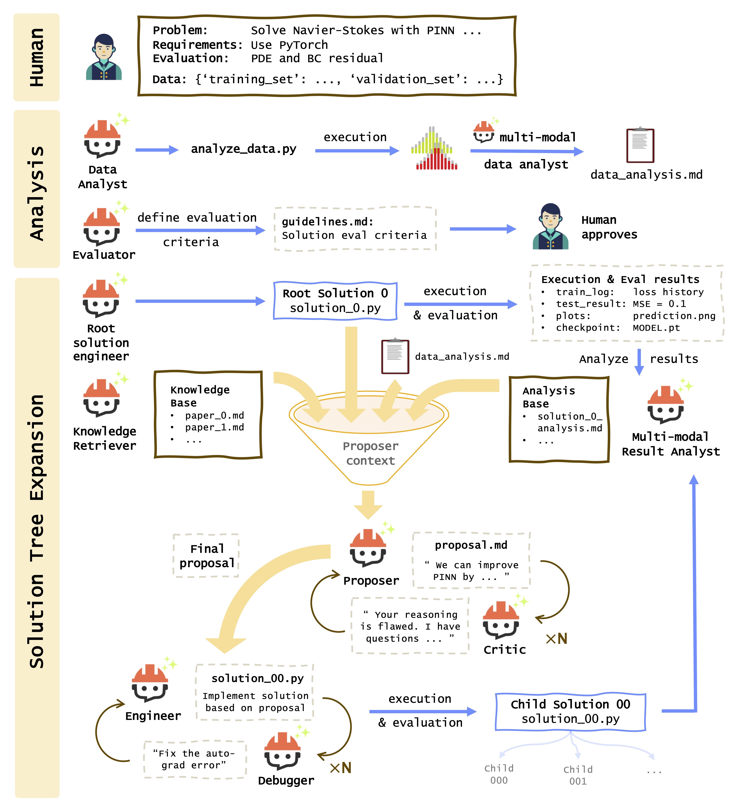

# AgenticSciML: Collaborative Multi-Agent Systems for Emergent Discovery in Scientific Machine Learning

This repository will contain the code and resources for the paper "AgenticSciML: Collaborative Multi-Agent Systems for Emergent Discovery in Scientific Machine Learning".

AgenticSciML is a collaborative multi-agent system in which over 10 specialized AI agents collaborate to propose, critique, and refine SciML solutions through structured reasoning and iterative evolution. The framework integrates structured debate, retrieval-augmented method memory, and ensemble-guided evolutionary search, enabling the agents to generate and assess new hypotheses about architectures and optimization procedures. 

## Framework

## Code

The code for AgenticSciML will be made available soon. Please check back later for updates.