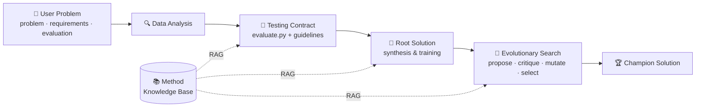

<div align="center">

# 🧪 AgenticSciML

### Collaborative Multi-Agent Systems for Emergent Discovery in Scientific Machine Learning

*Over 10 specialized AI agents that propose, critique, and evolve SciML solutions through structured reasoning, retrieval-augmented method memory, and ensemble-guided evolutionary search — discovering methods that outperform human-designed baselines by up to **four orders of magnitude**.*

<br/>

[](https://www.nature.com/articles/s44387-026-00102-5)
[](#-citation)
[](LICENSE)

[](https://www.python.org/)
[](https://pytorch.org/)
[](https://www.langchain.com/)
[](#-how-it-works)
[](https://github.com/Qile-J/AgenticSciML/stargazers)

**Qile Jiang · George Em Karniadakis**

<br/>


</div>

---

## 📖 Abstract

> Scientific Machine Learning (SciML) integrates data-driven inference with physical modeling to solve complex problems in science and engineering. However, the design of SciML architectures, loss formulations, and training strategies remains an expert-driven research process, requiring extensive experimentation and problem-specific insights. Here we introduce **AgenticSciML**, a collaborative multi-agent system in which over 10 specialized AI agents collaborate to propose, critique, and refine SciML solutions through structured reasoning and iterative evolution. The framework integrates structured debate, retrieval-augmented method memory, and ensemble-guided evolutionary search, enabling the agents to generate and assess new hypotheses about architectures and optimization procedures. Across physics-informed learning and operator learning tasks, the framework discovers solution methods that outperform single-agent and human-designed baselines by up to four orders of magnitude in error reduction. The agents produce novel strategies—including adaptive mixture-of-expert architectures, decomposition-based PINNs, and physics-informed operator learning models—that do not appear explicitly in the curated knowledge base. These results show that collaborative reasoning among AI agents can yield emergent methodological innovation, suggesting a path toward scalable, transparent, and autonomous discovery in scientific computing.

---

## ✨ Highlights

- 🤝 **10+ specialized agents** collaborate via **Multi-Agent Debate** — proposing, critiquing, and refining candidate solutions.
- 📚 **Retrieval-augmented method memory (RAG)** grounds the agents in a curated knowledge base of SciML literature and techniques.
- 🌳 **Ensemble-guided evolutionary tree search** mutates and selects solutions, balancing exploration and exploitation.
- 📉 **Up to 4 orders of magnitude** error reduction over single-agent and human-designed baselines.
- 💡 **Emergent, novel methods** — adaptive mixture-of-expert architectures, decomposition-based PINNs, and physics-informed operator models that are *not* explicitly present in the knowledge base.

---

## 🧠 How It Works

AgenticSciML turns a problem specification into a validated, continually-improving SciML solution through four phases. A curated **method knowledge base** feeds every reasoning step via retrieval.



| Phase | What happens |
|-------|--------------|
| **1 · Data Analysis** | Agents inspect the dataset and problem to ground downstream design choices. |
| **2 · Testing Contract** | A reusable evaluation contract (`evaluate.py` + engineering guidelines) is generated and human-approved. |
| **3 · Root Solution** | An initial solution is synthesized, validated, and trained as the tree's root. |
| **4 · Evolutionary Optimization** | A proposal–critic loop mutates and selects solutions in a tree search, evolving stronger methods. |

---

## ⚙️ Installation

**1 · Python packages.** Two purposes — *calling* the agents and *running* the code they generate:

```bash
pip install python-dotenv pydantic langgraph
pip install langchain-core langchain-anthropic langchain-openai langchain-google-genai
pip install torch numpy scipy matplotlib
```

**2 · API keys.** Create a `.env` file inside `src/` with the providers you plan to use:

```bash
ANTHROPIC_API_KEY=your_anthropic_key    # Claude models
OPENAI_API_KEY=your_openai_key          # GPT models
GOOGLE_API_KEY=your_google_key          # Gemini models
XAI_API_KEY=your_xai_key                # Grok models
```

> 🔒 Your `.env` is git-ignored by default — never commit your keys.

**3 · Problem setup.** Describe your problem in `src/USER_INPUT/`:

| File | Purpose |
|------|---------|
| `problem.md` | Problem description |
| `requirements.md` | Technical requirements |
| `evaluation.md` | Success-metric definition |
| `dataset_config.json` | *(optional)* dataset configuration |

A ready-to-run **function-approximation** example ships in `src/USER_INPUT/`.

---

## 🚀 Quickstart

We recommend the **three-step, human-in-the-loop** pipeline:

```bash
cd src

# Step 1 — Generate & approve the testing contract (evaluate.py + guidelines.md in TESTING/)
python main.py --mode contract-only

# Step 2 — Synthesize, validate, and train the root solution (SOLUTION_AND_OUTPUTS/solution_0/)
python main.py --mode root-only

# Step 3 — Evolve solutions via mutation, selection, and evolution
python main.py --mode evolve-only
```

Prefer to run everything end-to-end (no manual approval — use with care)?

```bash
python main.py --mode full
```

**Multi-GPU.** Tree expansion is parallelized across GPUs:

```bash
python main.py --mode full --gpu_ids 0 1 2 3   # use 4 specific GPUs
python main.py --mode full                      # auto-detect GPUs (falls back to CPU)
```

> 💡 **Best practice:** generate and carefully review the contract first (locally is fine), then run `root-only` and `evolve-only` on a cluster — these phases are compute-intensive and benefit from GPUs. An example SLURM script is provided in [`src/main_run.sh`](src/main_run.sh).

---

## 🗂️ Repository Structure

```
AgenticSciML/
├── framework.jpg          # System overview figure
└── src/
    ├── main.py            # Pipeline entry point (contract / root / evolve / full)
    ├── agents.py          # Agent definitions, roles, and model routing
    ├── create_contract.py # Phase 2 — testing-contract generation
    ├── create_root.py     # Phase 3 — root-solution synthesis
    ├── propose_critic.py  # Multi-agent debate (proposal–critic loop)
    ├── select_mutations.py# Evolutionary mutation selection
    ├── retrieve_*.py      # Retrieval-augmented method memory (RAG)
    ├── analyze.py         # Solution-tree analysis
    ├── telemetry.py       # Run telemetry
    ├── KB/                # Curated SciML method knowledge base
    ├── USER_INPUT/        # Your problem spec + example dataset
    └── main_run.sh        # Example SLURM launch script
```

---

## ⚠️ A Note on LLM Versions & Prompt Drift

This code was developed and validated against the **LLM generation available at the time of the paper (circa 2025)**. The agent prompts and model-interaction code have **not** been updated since.

If you run AgenticSciML against newer models, expect to do some retuning:

- 🔧 **Prompt drift** — newer models may respond differently to the existing prompts; you may need to re-tune wording, formatting, or system instructions to recover the reported behavior.
- 🌡️ **Sampling parameters** — some newer APIs restrict or ignore parameters such as `temperature` (e.g., certain reasoning models). The per-agent temperatures in `src/agents.py` may need adjustment or removal.
- 🔌 **API changes** — model IDs, client signatures, and provider SDKs evolve; parts of the model-routing code may need updating to match the latest LLM APIs.

We welcome PRs that modernize the prompts and provider integrations. 🙌

---

## 📑 Citation

If you use this code or build on this work, please cite:

```bibtex
@article{jiang2026agenticsciml,
  title={Agenticsciml: Collaborative multi-agent systems for emergent discovery in scientific machine learning},
  author={Jiang, Qile and Karniadakis, George},
  journal={npj Artificial Intelligence},
  year={2026},
  publisher={Nature Publishing Group UK London}
}
```

📄 **Paper:** https://www.nature.com/articles/s44387-026-00102-5

---

## 📜 License

Released under the **MIT License** — see [`LICENSE`](LICENSE) for details. You are free to use, modify, and distribute this software with attribution.

---

<div align="center">

*Toward scalable, transparent, and autonomous discovery in scientific computing.*

</div>
